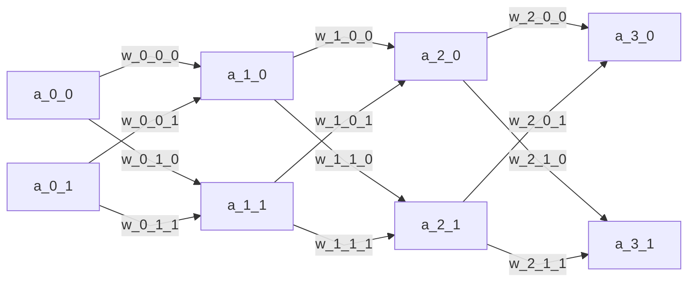

# Neural Network Approach

// %%{init: {"flowchart": {"defaultRenderer": "elk"}} }%%

$$z_{2} = w_{1}a_{1} + b_{2}$$

$$a_{2} = \sigma(z_{2})$$

$$z_{3} = w_{2}a_{2} + b_{3}$$

$$a_{3} = \sigma(z_{3})$$

$$c = C(a_{3}, y)$$

$$\frac{\partial c}{\partial w_{2}} = \frac{\partial c}{\partial a_{3}} \times \frac{\partial a_{3}}{\partial z_{3}} \times \frac{\partial z_{3}}{\partial w_{2}}$$
$$\frac{\partial c}{\partial w_{2}} = 2(a_{3}-y) \times a_{3}(1 - a_{3}) \times a_{2}$$

$$\frac{\partial c}{\partial w_{1}} = \frac{\partial c}{\partial a_{3}} \times \frac{\partial a_{3}}{\partial z_{3}} \times \frac{\partial z_{3}}{\partial a_{2}} \times \frac{\partial a_{2}}{\partial z_{2}} \times \frac{\partial z_{2}}{\partial w_{1}}$$
$$\frac{\partial c}{\partial w_{1}} = 2(a_{3}-y) \times a_{3}(1 - a_{3}) \times w_{2} \times a_{2} (1 - a_{2}) \times a_{1}$$

$$\frac{\partial c}{\partial b_{2}} = \frac{\partial c}{\partial a_{3}} \times \frac{\partial a_{3}}{\partial z_{3}} \times \frac{\partial z_{3}}{\partial b_{2}}$$

$$\frac{\partial z_{3}}{\partial b_{2}} = 1$$

$$\frac{\partial c}{\partial b_{1}} = \frac{\partial c}{\partial a_{3}} \times \frac{\partial a_{3}}{\partial z_{3}} \times \frac{\partial z_{3}}{\partial a_{2}} \times \frac{\partial a_{2}}{\partial z_{2}} \times \frac{\partial z_{2}}{\partial b_{1}}$$

$$\frac{\partial z_{2}}{\partial b_{1}} = 1$$
# NeuralNetwork
